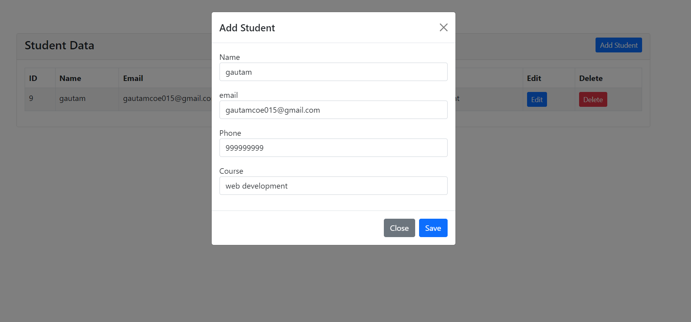

<h1>AJAX WITH CRUD 🐱‍👤</h1>

# AJAX CRUD Project


## 📋 Table of Contents

- [About the Project](#about-the-project)
- [Features](#features)
- [Technologies Used](#technologies-used)
- [Setup and Installation](#setup-and-installation)
- [Usage](#usage)
- [API Endpoints](#api-endpoints)
- [Screenshots](#screenshots)
- [Contributing](#contributing)
- [License](#license)
- [Contact](#contact)

## 📖 About the Project

This project demonstrates a simple CRUD (Create, Read, Update, Delete) application using AJAX for seamless data interaction without page reloads. It's built with modern web technologies and showcases how to efficiently manage data using AJAX requests.

## ✨ Features

- **Create:** Add new records to the database without reloading the page.
- **Read:** Fetch and display data dynamically.
- **Update:** Edit existing records and update the database in real-time.
- **Delete:** Remove records with instant feedback.

## 🛠 Technologies Used

- **Frontend:**
  - HTML5, CSS3, Bootstrap
  - JavaScript, jQuery, AJAX
- **Backend:**
  - PHP, Laravel
  - MySQL
- **Tools:**
  - Composer
  - Git, GitHub

## 🚀 Setup and Installation

1. **Clone the repository:**

    ```bash
    git clone https://github.com/yourusername/Ajax_crud.git
    cd Ajax_crud
    ```

2. **Install dependencies:**

    ```bash
    composer install
    npm install
    ```

3. **Configure environment variables:**

    - Copy the `.env.example` file to `.env`.
    - Update database credentials and other settings in the `.env` file.

4. **Run migrations:**

    ```bash
    php artisan migrate
    ```

5. **Start the development server:**

    ```bash
    php artisan serve
    ```

6. **Access the application:**

    Open your browser and navigate to `http://localhost:8000`.

## 📚 Usage

### Adding a New Record

1. Fill in the form fields with the required data.
2. Click the "Add" button.
3. The new record will appear in the table without reloading the page.

### Editing a Record

1. Click the "Edit" button next to the record you want to update.
2. Modify the data in the form that appears.
3. Click "Update" to save changes.

### Deleting a Record

1. Click the "Delete" button next to the record you want to remove.
2. The record will be removed instantly.

## 🔗 API Endpoints

- **Fetch Students:** `GET /fetch_students`
- **Add Student:** `POST /students`
- **Edit Student:** `GET /edit_student/{id}`
- **Update Student:** `PUT /update-student/{id}`
- **Delete Student:** `DELETE /delete_student/{id}`

## 📸 Screenshots

### Home Page


### Adding a Record


### Editing a Record


## 🤝 Contributing

Contributions are what make the open-source community such an amazing place to learn, inspire, and create. Any contributions you make are **greatly appreciated**.

1. Fork the Project
2. Create your Feature Branch (`git checkout -b feature/AmazingFeature`)
3. Commit your Changes (`git commit -m 'Add some AmazingFeature'`)
4. Push to the Branch (`git push origin feature/AmazingFeature`)
5. Open a Pull Request

## 📝 License

Distributed under the MIT License. See `LICENSE` for more information.

## 📞 Contact

Your Name - [@yourhandle](https://twitter.com/yourhandle) - youremail@example.com

Project Link: [https://github.com/yourusername/Ajax_crud](https://github.com/yourusername/Ajax_crud)
